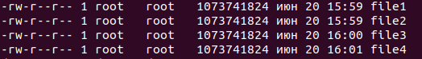

1. Создать 4 файла размером 1Гб каждый, создать loopback устройства из файлов при помощи losetup. :
  ```sh
  sudo dd if=/dev/zero of=./file1 bs=1G count=1
  sudo dd if=/dev/zero of=./file2 bs=1G count=1
  sudo dd if=/dev/zero of=./file3 bs=1G count=1
  sudo dd if=/dev/zero of=./file4 bs=1G count=1
  ```
  <p align="left">
  <a href="https://github.com/dbandarovich/LVM/blob/main/images/files.PNG">
    
  </a>
  <p align="left">
