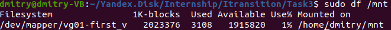

1. Создать 4 файла размером 1Гб каждый, создать loopback устройства из файлов при помощи losetup. :
    
    Creating a 1 GB file, called file1..4.
    
    ```sh
    sudo dd if=/dev/zero of=./file1 bs=1G count=1
    sudo dd if=/dev/zero of=./file2 bs=1G count=1
    sudo dd if=/dev/zero of=./file3 bs=1G count=1
    sudo dd if=/dev/zero of=./file4 bs=1G count=1
    ```
    <p align="left">
    <a href="https://github.com/dbandarovich/LVM/blob/main/images/losetup.png">
      
    </a>
    <p align="left">
    
    <p align="left">
    <a href="https://github.com/dbandarovich/LVM/blob/main/images/files.PNG">
      
    </a>
    <p align="left">
  
        
2. Создать физические разделы на этих устройствах при помощи pvcreate. Создать volume group из первых двух девайсов. На ней создать logical volume при помощи lvcreate. 
    
    Create a physical volume.    
        
    ```sh
    sudo pvcreate /dev/loop15
    sudo pvcreate /dev/loop16
    sudo pvcreate /dev/loop17
    sudo pvcreate /dev/loop18
    ```
    <p align="left">
    <a href="https://github.com/dbandarovich/LVM/blob/main/images/new_volumes.png">
      
    </a>
    <p align="left">   
      
    Create volume group whose name vg01.
        
    ```sh
    sudo vgcreate vg01 /dev/loop15 /dev/loop16 
    ```
        
    <p align="left">
    <a href="https://github.com/dbandarovich/LVM/blob/main/images/group01.png">
      
    </a>
    <p align="left"> 
          
    Create logical volume of size 2G with name as first_v
        
    ```sh
    sudo lvcreate -L 1.99G -n first_v vg01. 
    ```

    <p align="left">
    <a href="https://github.com/dbandarovich/LVM/blob/main/images/lvdisplay.png">
      
    </a>
    <p align="left">         
      
3. Создать файловую систему при помощи mkfs.ext3, подмонтировать её, посмотреть какой размер. 
        
    Format logical partition to ext3 filesystem.
        
    ```sh
    sudo mke2fs -j /dev/vg01/first_v 
    ```    
    <p align="left">
    <a href="https://github.com/dbandarovich/LVM/blob/main/images/mke2fs.png">
      
    </a>
    <p align="left">       
        
    Mount the volume to any directory.
        
    ```sh
    sudo mount /dev/vg01/first_v /mnt
    sudo df /mnt
    ```    

    <p align="left">
    <a href="https://github.com/dbandarovich/LVM/blob/main/images/lvscan.png">
      
    </a>
    <p align="left">        
        
  4. Добавить оставшиеся два  устройства в группу. Изменить размер логического тома, затем размер файловой системы. Проверить размер при помощи df. В качестве результата сделать два скриншота команд. 
        
        
